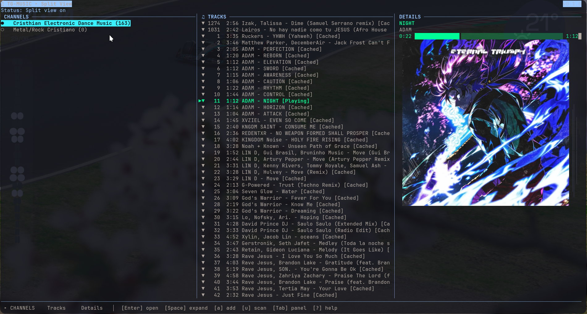

#               tg-music-cli

[](https://github.com/andrwvaz2/tg-music-cli/actions/workflows/ci.yml)
[](https://www.python.org/downloads/)
[](https://opensource.org/licenses/MIT)


Terminal music player for Telegram channels.

## Preview

### Split View (TUI)
Here is the 3-panel **Split View** layout rendering cover art in the terminal using `chafa`:



### Demo Video
Check out the player in action, featuring navigation, pre-caching, and queue management:

https://github.com/user-attachments/assets/fdd5f457-2e5a-4c84-bf5b-d8f0cad070d7

*(Alternative local video mirror: [assets/demo.mp4](assets/demo.mp4))*

```text
┌──────────────────────────────────────────────────────────┐
│                                                          │
│                    T G  -  M U S I C                     │
│       Terminal music player for Telegram channels        │
│                                                          │
├──────────────────────────────────────────────────────────┤
│                                                          │
│                          SETUP                           │
│                                                          │
│     1. Go to https://my.telegram.org/apps                │
│     2. Log in and get your api_id and api_hash           │
│     3. Run configuration command:                        │
│     $ tg-music init                                      │
│                                                          │
└──────────────────────────────────────────────────────────┘
```

## Features

* **Folder-like Navigation:** Browse indexed Telegram channels as if they were local directories.
* **Smart Pre-caching:** Background download of the next 3 tracks in the play queue to prevent playback gaps.
* **Embedded Cover Art:** Album art rendering in the terminal using `chafa` (with high-resolution support in Kitty/Ghostty and character-art fallback in other terminals).
* **Local Database:** Fast SQLite integration for tracking playback history, favorites, and tags.
* **Multiple Layouts:** Classic view, 3-panel Split View (`P`), and a compact single-line Mini View (`M`).
* **Blocklist:** Ignore tracks to automatically prevent them from showing up or being bulk-downloaded.


---

## Requirements

| Dependency | Version | Required? |
|------------|---------|-----------|
| Python | >= 3.11 | Yes |
| [mpv](https://mpv.io/) | Any recent | Yes (audio playback) |
| [chafa](https://hpjansson.org/chafa/) | Any recent | No (cover art in terminal) |
| [uv](https://docs.astral.sh/uv/) | Any recent | Recommended (package manager) |

* **Linux:** Fully supported (native experience).
* **macOS:** Fully supported (requires installation of dependencies via Homebrew).
* **Windows:** Supported via **WSL (Windows Subsystem for Linux)** (recommended) or native Windows (requires Unix socket support in Windows Terminal/OS, see below).

---

## Installation & Setup

### 1. Install System Dependencies

This project relies on `mpv` for audio playback and `chafa` (optional) for terminal cover art rendering.

#### Linux

##### Debian / Ubuntu
```bash
sudo apt update && sudo apt install -y mpv chafa
```

##### Arch Linux
```bash
sudo pacman -S mpv chafa
```

##### Fedora
```bash
sudo dnf install mpv chafa
```

##### NixOS
Add `mpv` and `chafa` to `environment.systemPackages` or run them in a shell:
```bash
nix-shell -p mpv chafa
```

#### macOS
```bash
brew install mpv chafa
```

#### Windows
* **Via WSL (Recommended):** Open your WSL terminal (e.g., Ubuntu) and follow the **Linux** installation commands.
* **Native Windows:** Install dependencies via [Scoop](https://scoop.sh/) or [Chocolatey](https://chocolatey.org/):
  ```powershell
  # Using Scoop
  scoop install mpv chafa
  # Using Chocolatey
  choco install mpv chafa
  ```

### 2. Install the Project

Clone this repository:
```bash
git clone https://github.com/andrwvaz2/tg-music-cli.git
cd tg-music-cli
```

Choose one of the following methods to run or install:

#### Method A: Using `uv` (Recommended & Fastest)
You can run commands directly without a global installation:
```bash
uv run tg-music <command>
```
Or install it as a globally accessible command:
```bash
uv tool install .
```

#### Method B: Standard Python (pip & venv)
```bash
# Create and activate virtual environment
python3 -m venv .venv
source .venv/bin/activate  # On Windows (cmd): .venv\Scripts\activate.bat

# Install the package and dependencies
pip install .
```

---

## Quickstart

### Why do I need Telegram API credentials?

This app uses [Telethon](https://docs.telethon.dev/) (an open-source Telegram client library) to connect directly to Telegram's API. Telegram requires any unofficial client to authenticate with its own `api_id` and `api_hash` — this is how Telegram distinguishes official apps from third-party ones. You can get yours free at [my.telegram.org/apps](https://my.telegram.org/apps) in under 2 minutes. **Your credentials never leave your machine** — they are stored locally in `~/.local/share/tg-music/session.session` and are only used to authenticate your personal Telegram account.

1. **Configure Telegram Credentials:**
   Go to [my.telegram.org](https://my.telegram.org), log in, create an application, and retrieve your credentials.
   
   Run the initialization wizard:
   ```bash
   # If installed via uv tool or pip:
   tg-music init
   
   # Or using uv run:
   uv run tg-music init
   ```

2. **Scan a Music Channel:**
   Index metadata from a public Telegram channel:
   ```bash
   # If installed globally:
   tg-music scan https://t.me/Christian_Electronic --limit 300
   
   # Or using uv run:
   uv run tg-music scan https://t.me/Christian_Electronic --limit 300
   ```

3. **Start the TUI Player:**
   Launch the interactive interface:
   ```bash
   # If installed globally:
   tg-music tui
   
   # Or using uv run:
   uv run tg-music tui
   ```

*Note: On first execution, the Telegram client will prompt you for your phone number and verification code to authenticate. The session details are securely stored locally at `~/.local/share/tg-music/session.session`.*

---

## TUI Layouts

### Classic View (Press `C`)
A clean two-panel layout inspired by terminal music players like cmus/ncmpcpp:
1. **Library:** Left panel showing channels and local folders.
2. **Playlist:** Right panel with 4 columns: Duration, Artist, Title, Album.
3. **Control:** Status bar with playback state, volume, speed, and progress bar.
4. **Lyrics:** Dedicated box for lyrics display.
5. **Help bar:** Footer with keyboard shortcuts.

### Split View (Press `P`)
Splits the interface into three columns:
1. **Channels:** List of added channels and local folders.
2. **Tracks:** Songs inside the selected channel.
3. **Details:** Current track metadata, cover art, and play queue.

### Mini View (Press `M`)
Reduces the TUI to a single bottom bar showing progress, track title, volume, and playback state.

---

## Keybindings

### Navigation and Playback

| Key | Action |
|---|---|
| `Arrows` / `j`/`k` | Move cursor |
| `Enter` | Open channel / Play selected track |
| `Space` / `→` | Expand channel |
| `Backspace` / `←` | Collapse channel / Return to channels list |
| `s` | Stop playback |
| `n` | Next track |
| `+` / `-` | Adjust volume |
| `/` | Search in active list |
| `r` | Refresh list |
| `C` | Toggle Classic View |
| `P` | Toggle Split View |
| `M` | Toggle Mini View |
| `q` | Exit player |

### Management and Queue

| Key | Action |
|---|---|
| `e` | Enqueue selected track |
| `[` / `]` | Move track up/down in the play queue |
| `f` | Toggle favorite status |
| `1` | Filter list by favorites |
| `t` | Edit tags for selected track |
| `L` | Toggle lyrics display |
| `m` | Download all missing tracks in current view |
| `u` | Scan older tracks in selected channel |
| `w` | Check for updates in active channel |
| `W` | Toggle background watcher daemon |
| `x` | Ignore track (deletes local file and skips in future downloads) |

---

## CLI Commands

The `tg-music` command allows managing the player directly from the shell:

### Channels
```bash
tg-music add-channel <URL_OR_USER> --limit 300   # Add a channel
tg-music channels                               # List saved channels
tg-music scan <URL_OR_USER> --limit 300          # Index metadata
tg-music scan <URL_OR_USER> --cache              # Index and download audio
```

### Playback and Downloads
```bash
tg-music play <ID>                              # Play a specific track
tg-music play-latest <URL_OR_USER>               # Play latest track in a channel
tg-music cache <URL_OR_USER> --workers 2          # Download missing tracks to cache
```

### Tags Management
```bash
tg-music tag add <ID> <tag>                     # Add a tag to a track
tg-music tag remove <ID> <tag>                  # Remove a tag
tg-music tag list                               # List all tags in the system
tg-music tag show <ID>                          # Show tags of a track
```

### Ignoring & Favorites
```bash
tg-music favorite <ID>                          # Toggle favorite status
tg-music ignore <ID>                            # Ignore track (deletes local file)
tg-music unignore <ID>                          # Stop ignoring track
tg-music ignored                                # List ignored tracks
```

---

## File Locations

* **Audio Cache:** `~/.cache/tg-music/audio`
* **SQLite Database:** `~/.local/share/tg-music/library.sqlite3`
* **Telegram Session:** `~/.local/share/tg-music/session.session`

---

## Contributions & Feedback

Contributions, bug reports, and feature requests are welcome! Feel free to open an issue or submit a pull request on the GitHub repository.

---

## Troubleshooting

### Channel is private or inaccessible

If a channel returns no tracks or shows "channel not found", make sure:
- The channel is public (or you are a member of the private channel)
- The channel URL is correct (e.g., `https://t.me/channel_name`)
- You have authenticated with `tg-music init` and your session is valid

### Invalid API credentials

If you see "api_id/api_hash invalid" errors:
1. Go to [my.telegram.org/apps](https://my.telegram.org/apps)
2. Verify your credentials are correct
3. Run `tg-music init` again to update them
4. Delete the old session: `rm ~/.local/share/tg-music/session.session`

### mpv not found

If playback fails with "mpv not found":
- **Linux:** `sudo apt install mpv` (or `pacman -S mpv`, `dnf install mpv`)
- **macOS:** `brew install mpv`
- Verify: `mpv --version`

### Cover art not showing (chafa)

If cover art doesn't render in the terminal:
- Install chafa: `sudo apt install chafa` (or `brew install chafa`)
- Use a terminal with image support: **Kitty**, **Ghostty**, or **WezTerm** for best results
- Other terminals will fall back to ASCII art automatically
- Verify: `chafa --version`

---

## Disclaimer

tg-music-cli is a personal music organization tool. It plays audio from public Telegram channels that you have access to through your own Telegram account. The developer does not provide, host, or distribute any media content.

You are responsible for how you use this tool. Make sure you have the right to access and play the content you listen to through Telegram.
