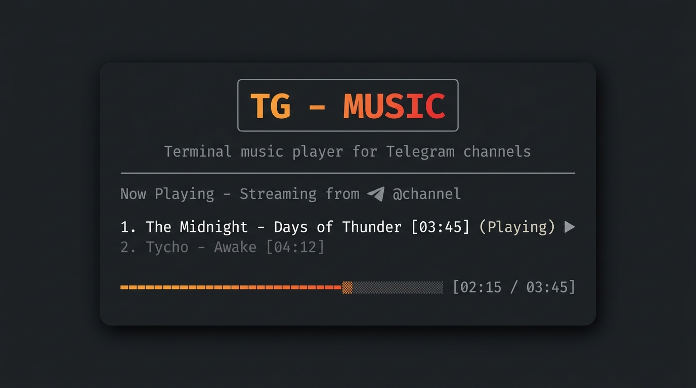

# tg-music-cli



Terminal music player for Telegram channels.


```text
┌──────────────────────────────────────────────────────────┐
│                                                          │
│                    T G  -  M U S I C                     │
│       Terminal music player for Telegram channels        │
│                                                          │
├──────────────────────────────────────────────────────────┤
│                                                          │
│                          SETUP                           │
│                                                          │
│     1. Go to https://my.telegram.org/apps                │
│     2. Log in and get your api_id and api_hash           │
│     3. Run configuration command:                        │
│     $ tg-music init                                      │
│                                                          │
└──────────────────────────────────────────────────────────┘
```

## Features

* **Folder-like Navigation:** Browse indexed Telegram channels as if they were local directories.
* **Smart Pre-caching:** Background download of the next 3 tracks in the play queue to prevent playback gaps.
* **Embedded Cover Art:** Album art rendering in the terminal using `chafa` (with high-resolution support in Kitty/Ghostty and character-art fallback in other terminals).
* **Local Database:** Fast SQLite integration for tracking playback history, favorites, and tags.
* **Multiple Layouts:** Classic view, 3-panel Split View (`P`), and a compact single-line Mini View (`M`).
* **Blocklist:** Ignore tracks to automatically prevent them from showing up or being bulk-downloaded.

---

## Requirements

* Python 3.11+
* `uv` (optional, recommended for fast execution)
* `mpv` (audio playback backend)
* `chafa` (optional, for cover art rendering)
* A Telegram application registered at `https://my.telegram.org` to obtain `api_id` and `api_hash`.

---

## Quickstart

If you are using `uv`:

```bash
# Navigate to the project directory
cd ~/Proyectos/tg-music-cli

# Configure Telegram credentials
uv run tg-music init

# Scan a music channel
uv run tg-music scan https://t.me/Christian_Electronic --limit 300

# Start the interactive TUI player
uv run tg-music tui
```

*Note: On first run, the Telegram API will ask for your phone number and verification code. The session is safely stored locally at `~/.local/share/tg-music/session.session`.*

---

## TUI Layouts

### Split View (Press `P`)
Splits the interface into three columns:
1. **Channels:** List of added channels and local folders.
2. **Tracks:** Songs inside the selected channel.
3. **Details:** Current track metadata, cover art, and play queue.

### Mini View (Press `M`)
Reduces the TUI to a single bottom bar showing progress, track title, volume, and playback state.

---

## Keybindings

### Navigation and Playback

| Key | Action |
|---|---|
| `Arrows` / `j`/`k` | Move cursor |
| `Enter` | Open channel / Play selected track |
| `Space` / `→` | Expand channel |
| `Backspace` / `←` | Collapse channel / Return to channels list |
| `s` | Stop playback |
| `n` | Next track |
| `+` / `-` | Adjust volume |
| `/` | Search in active list |
| `r` | Refresh list |
| `q` | Exit player |

### Management and Queue

| Key | Action |
|---|---|
| `e` | Enqueue selected track |
| `[` / `]` | Move track up/down in the play queue |
| `f` | Toggle favorite status |
| `1` | Filter list by favorites |
| `t` | Edit tags for selected track |
| `L` | Toggle lyrics display |
| `m` | Download all missing tracks in current view |
| `u` | Scan older tracks in selected channel |
| `w` | Check for updates in active channel |
| `W` | Toggle background watcher daemon |
| `x` | Ignore track (deletes local file and skips in future downloads) |

---

## CLI Commands

The `tg-music` command allows managing the player directly from the shell:

### Channels
```bash
tg-music add-channel <URL_OR_USER> --limit 300   # Add a channel
tg-music channels                               # List saved channels
tg-music scan <URL_OR_USER> --limit 300          # Index metadata
tg-music scan <URL_OR_USER> --cache              # Index and download audio
```

### Playback and Downloads
```bash
tg-music play <ID>                              # Play a specific track
tg-music play-latest <URL_OR_USER>               # Play latest track in a channel
tg-music cache <URL_OR_USER> --workers 2          # Download missing tracks to cache
```

### Tags Management
```bash
tg-music tag add <ID> <tag>                     # Add a tag to a track
tg-music tag remove <ID> <tag>                  # Remove a tag
tg-music tag list                               # List all tags in the system
tg-music tag show <ID>                          # Show tags of a track
```

### Ignoring & Favorites
```bash
tg-music favorite <ID>                          # Toggle favorite status
tg-music ignore <ID>                            # Ignore track (deletes local file)
tg-music unignore <ID>                          # Stop ignoring track
tg-music ignored                                # List ignored tracks
```

---

## File Locations

* **Audio Cache:** `~/.cache/tg-music/audio`
* **SQLite Database:** `~/.local/share/tg-music/library.sqlite3`
* **Telegram Session:** `~/.local/share/tg-music/session.session`

---

## Contributions & Feedback

Contributions, bug reports, and feature requests are welcome! Feel free to open an issue or submit a pull request on the GitHub repository.

---

## Disclaimer

This software is provided for educational and personal use only. The developer does not host, distribute, or promote the download of copyrighted material. 

The user is solely responsible for ensuring that accessing and playing content from Telegram channels through this tool complies with local laws and the platform's Terms of Service.
