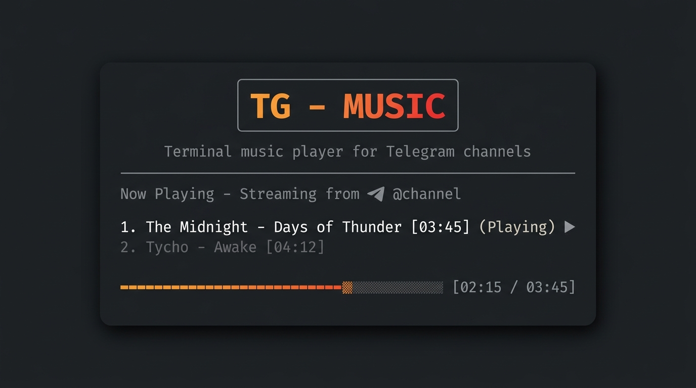
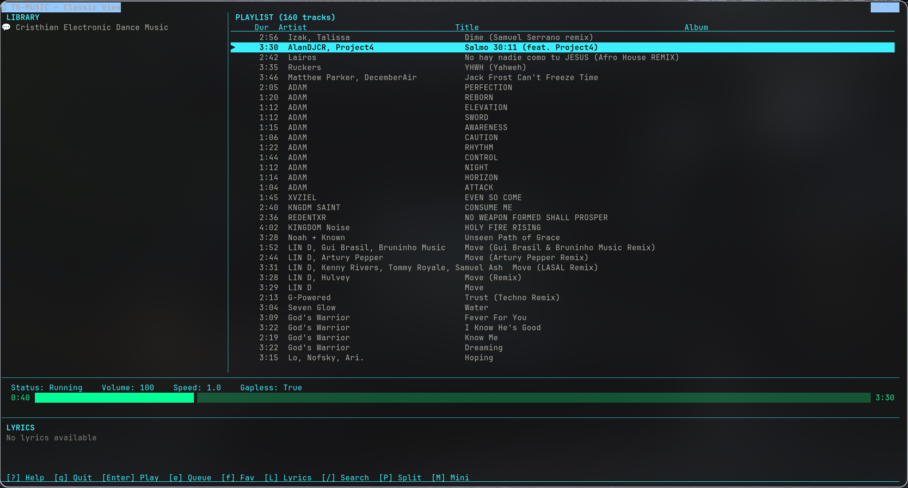
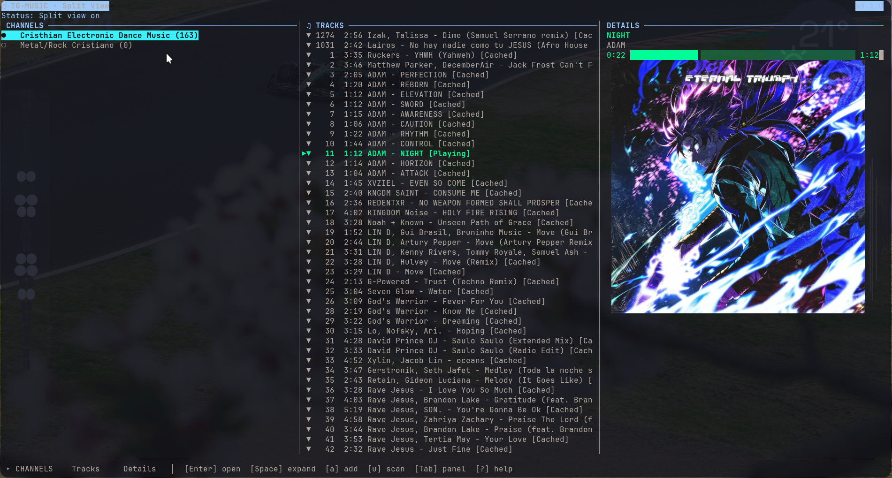

<p align="center">
  <a href="README.md">English</a> • <b>Español</b>
</p>

# tg-music-cli

<p align="center">
  <a href="https://github.com/DenverCoder1/readme-typing-svg">
    
  </a>
</p>

<p align="center">
  <a href="https://github.com/andrwvaz2/tg-music-cli/actions/workflows/ci.yml"></a>
  <a href="https://www.python.org/downloads/"></a>
  <a href="https://opensource.org/licenses/MIT"></a>
  <a href="https://github.com/andrwvaz2/tg-music-cli/stargazers"></a>
  <a href="https://github.com/andrwvaz2/tg-music-cli/issues"></a>
</p>

<p align="center">
  
  
  
  
  
</p>

<p align="center">
  
</p>

---

## Características

* **Navegación tipo carpetas:** Explora canales indexados de Telegram como si fueran directorios locales.
* **Precarga inteligente (Smart Pre-caching):** Descarga automática en segundo plano de las siguientes 3 pistas en cola para eliminar interrupciones en la reproducción.
* **Carátulas integradas:** Renderizado de portadas directamente en la terminal mediante `chafa` (gráficos de alta resolución en Kitty/Ghostty y compatibilidad en modo texto/ASCII en cualquier otra terminal).
* **Base de datos local:** Integración con SQLite rápido para historial de reproducción, favoritos, listas y etiquetas (tags).
* **Múltiples vistas de interfaz (TUI):** Vista Clásica de 2 paneles (`C`), Vista Dividida de 3 paneles (`P`) y Vista Mini compacta (`M`).
* **Temas y Ecualizador Visual:** Múltiples paletas de 256 colores (Oscuro, Claro, Dracula, Nord, etc.), selector interactivo de temas (`F2`), ecualizador animado y barras de progreso tipo slider.
* **Búsqueda global (FTS5):** Búsqueda de texto completo instantánea en todas las pistas y canales indexados (`G`).
* **Soporte MPRIS2:** Integración con teclas multimedia de escritorio Linux, pantalla de bloqueo y control externo mediante `playerctl` con portada de álbum.
* **Lista de exclusión (Blocklist):** Ignora canciones para eliminarlas de la caché local y omitirlas automáticamente en futuros escaneos y descargas.

---

## Demostración y Vistas

### Vista Clásica (Pulsa `C`)
Un diseño limpio de dos paneles inspirado en reproductores tradicionales como *cmus* y *ncmpcpp*:
1. **Biblioteca:** Panel izquierdo que muestra canales y carpetas locales.
2. **Lista de pistas:** Panel derecho con 4 columnas: Duración, Artista, Título y Álbum.
3. **Control:** Barra de estado con progreso, volumen, velocidad y estado de reproducción.
4. **Letras:** Panel dedicado para la visualización de letras de canciones.
5. **Barra de ayuda:** Pie de página interactivo con atajos de teclado.



### Vista Dividida (Pulsa `P`)
Divide la interfaz en tres columnas:
1. **Canales:** Lista de canales agregados y carpetas locales.
2. **Pistas:** Lista de canciones dentro del canal seleccionado.
3. **Detalles:** Metadatos de la pista en reproducción, carátula de álbum y cola.



### Vista Mini (Pulsa `M`)
Reduce la TUI a una sola barra inferior que muestra la barra de progreso, título de la pista, volumen y estado de reproducción.

### Video Demo
Mira el reproductor en acción con navegación en tiempo real, precarga y gestión de la cola:

https://github.com/user-attachments/assets/fdd5f457-2e5a-4c84-bf5b-d8f0cad070d7

*(Espejo de video local: [assets/demo.mp4](assets/demo.mp4))*

---

## Requisitos

| Dependencia | Versión | ¿Obligatoria? | Propósito |
|-------------|---------|:-------------:|-----------|
| Python | >= 3.11 | Sí | Entorno de ejecución |
| [mpv](https://mpv.io/) | Reciente | Sí | Motor de reproducción de audio |
| [dbus-next](https://github.com/altdesktop/python-dbus-next) | >= 0.2.3 | Sí (Auto) | Integración D-Bus y teclas multimedia MPRIS2 |
| [chafa](https://hpjansson.org/chafa/) | Reciente | No | Renderizado de portadas en terminal |
| [playerctl](https://github.com/altdesktop/playerctl) | Reciente | No | Utilidad CLI para control multimedia de escritorio |
| [uv](https://docs.astral.sh/uv/) | Reciente | Recomendado | Gestor rápido de paquetes y entornos |

* **Linux:** Soporte nativo completo.
* **macOS:** Soporte completo (instalando dependencias vía Homebrew).
* **Windows:** Compatible mediante **WSL (Windows Subsystem for Linux)** (recomendado) o de forma nativa (vía Scoop/Chocolatey).

---

## Instalación y Configuración

### 1. Instalar dependencias del sistema

Este proyecto utiliza `mpv` para la reproducción de audio, `chafa` (opcional) para renderizar portadas en la terminal y `playerctl` (opcional) para control multimedia desde el escritorio. Las dependencias de Python (como `dbus-next`, `telethon` y `mutagen`) se instalan automáticamente.

#### Linux

##### Debian / Ubuntu / Mint
```bash
sudo apt update && sudo apt install -y mpv chafa playerctl
```

##### Arch Linux / Manjaro
```bash
sudo pacman -S mpv chafa playerctl
```

##### Fedora
```bash
sudo dnf install mpv chafa playerctl
```

##### NixOS
Agrega `mpv`, `chafa` y `playerctl` a `environment.systemPackages` o ejecútalos en un shell:
```bash
nix-shell -p mpv chafa playerctl
```

#### macOS
```bash
brew install mpv chafa
```

#### Windows
* **Windows Nativo (PowerShell):**
  Instala `mpv` con el gestor oficial de Windows (`winget`):
  ```powershell
  winget install mpv.mpv
  winget install chafa   # Opcional, para carátulas en terminal
  ```
  *(Gestores alternativos: `scoop install mpv chafa` o `choco install mpv chafa`)*.
* **Vía WSL (Recomendado para la mejor experiencia gráfica en terminal):** Abre la terminal de WSL (ej. Ubuntu) y ejecuta los comandos de instalación de **Linux**.

---

### 2. Instalar el proyecto

Clona este repositorio:
```bash
git clone https://github.com/andrwvaz2/tg-music-cli.git
cd tg-music-cli
```

Elige uno de los siguientes métodos de instalación:

#### Método A: Con `uv` (Recomendado y más rápido)
Puedes ejecutar comandos directamente sin instalación global:
```bash
uv run tg-music <comando>
```
O instalarlo como herramienta accesible globalmente:
```bash
uv tool install .
```

#### Método B: Python estándar (pip y venv)
```bash
# Crear y activar entorno virtual
python3 -m venv .venv
source .venv/bin/activate  # En Windows (cmd): .venv\Scripts\activate.bat

# Instalar el paquete y sus dependencias
pip install .
```

### Actualización

Para actualizar a la versión más reciente:

```bash
# Si se instaló con uv tool:
uv tool install --upgrade .

# Si se clonó con git:
cd tg-music-cli
git pull
uv sync

# Si se instaló vía pip:
pip install --upgrade .
```

---

## Inicio Rápido

### ¿Por qué se requieren credenciales de la API de Telegram?

Esta aplicación utiliza [Telethon](https://docs.telethon.dev/) (una librería cliente de código abierto para Telegram) para conectarse directamente a la API oficial. Telegram exige que cualquier cliente externo se autentique con su propio `api_id` y `api_hash` para identificar el tráfico de la aplicación. Puedes obtener las tuyas gratuitamente en [my.telegram.org/apps](https://my.telegram.org/apps) en menos de 2 minutos. **Tus credenciales nunca salen de tu máquina**; se guardan de forma local en `~/.local/share/tg-music/session.session` y solo se usan para autenticar tu cuenta personal.

1. **Configura tus credenciales de Telegram:**
   Inicia sesión en [my.telegram.org](https://my.telegram.org), crea una aplicación y copia tus credenciales.
   
   Ejecuta el asistente de configuración inicial:
   ```bash
   tg-music init
   ```
   *(O usando uv: `uv run tg-music init`)*

2. **Indexa un canal musical:**
   Escanea los metadatos de cualquier canal público de Telegram:
   ```bash
   tg-music scan https://t.me/Christian_Electronic --limit 300
   ```

3. **Inicia el reproductor interactivo (TUI):**
   Abre la interfaz en tu terminal:
   ```bash
   tg-music tui
   ```

> [!NOTE]
> En la primera ejecución o al ejecutar `tg-music login`, el cliente de Telegram te solicitará tu número de teléfono y el código de verificación para autenticarte. La sesión queda guardada de forma segura en `~/.local/share/tg-music/session.session`.

---

## Atajos de Teclado

### Navegación y Reproducción

| Tecla | Acción |
|:---:|---|
| <kbd>↑</kbd> <kbd>↓</kbd> / <kbd>j</kbd> <kbd>k</kbd> | Mover el cursor |
| <kbd>RePág</kbd> <kbd>AvPág</kbd> | Saltar 10 pistas arriba / abajo |
| <kbd>Inicio</kbd> / <kbd>Fin</kbd> | Ir a la primera / última pista |
| <kbd>Enter</kbd> | Abrir canal seleccionado / Reproducir pista |
| <kbd>Espacio</kbd> | Desplegar o plegar canal / carpeta |
| <kbd>Backspace</kbd> / <kbd>←</kbd> | Plegar canal / Regresar a la lista de canales |
| <kbd>Tab</kbd> | Alternar foco entre paneles (Vista Dividida) |
| <kbd>n</kbd> / <kbd>→</kbd> | Siguiente pista |
| <kbd>p</kbd> / <kbd>←</kbd> | Pista anterior |
| <kbd>s</kbd> | Detener reproducción |
| <kbd>S</kbd> | Alternar modo aleatorio (*shuffle*) |
| <kbd>R</kbd> | Alternar modo de repetición (*repeat*) |
| <kbd>+</kbd> / <kbd>-</kbd> | Subir / Bajar volumen |
| <kbd>/</kbd> | Buscar / filtrar en la lista activa |
| <kbd>G</kbd> | Búsqueda global de texto completo (FTS5) en toda la biblioteca |
| <kbd>r</kbd> | Recargar lista de pistas |
| <kbd>c</kbd> | Abrir explorador de canales |
| <kbd>g</kbd> | Abrir carpeta de música local |
| <kbd>a</kbd> | Prompt para añadir canal o lista de reproducción |

### Vistas, Temas y General

| Tecla | Acción |
|:---:|---|
| <kbd>C</kbd> | Alternar Vista Clásica |
| <kbd>P</kbd> | Alternar Vista Dividida |
| <kbd>M</kbd> | Alternar Vista Mini |
| <kbd>L</kbd> | Mostrar / Ocultar panel de letras de canciones |
| <kbd>T</kbd> | Rotar tema de color (Dark, Light, Dracula, Nord, etc.) |
| <kbd>F2</kbd> | Abrir selector interactivo de temas |
| <kbd>:</kbd> | Modo comando tipo Vim (ej. `:login` para autenticar) |
| <kbd>?</kbd> / <kbd>H</kbd> / <kbd>F1</kbd> | Abrir / cerrar panel interactivo de ayuda |
| <kbd>q</kbd> | Salir del reproductor |

### Gestión, Listas y Cola

| Tecla | Acción |
|:---:|---|
| <kbd>e</kbd> | Añadir pista a la cola de reproducción |
| <kbd>E</kbd> | Vaciar cola de reproducción |
| <kbd>[</kbd> / <kbd>]</kbd> | Reordenar pista dentro de la cola o lista de reproducción activa |
| <kbd>f</kbd> | Marcar / Desmarcar como favorito |
| <kbd>1</kbd> | Filtrar lista por canciones favoritas |
| <kbd>t</kbd> | Editar etiquetas (tags) de la pista seleccionada |
| <kbd>y</kbd> | Mostrar panel de listas de reproducción (playlists) |
| <kbd>Y</kbd> | Añadir pista a una playlist (la crea si no existe) |
| <kbd>m</kbd> | Descargar todas las pistas faltantes en la vista actual |
| <kbd>u</kbd> | Escanear pistas más antiguas en el canal seleccionado |
| <kbd>w</kbd> | Comprobar nuevas publicaciones en el canal activo |
| <kbd>W</kbd> | Alternar demonio de monitoreo en segundo plano |
| <kbd>x</kbd> | Ignorar pista (elimina archivo local y la omite en futuras descargas) |

---

## Comandos de la CLI

El comando `tg-music` (también disponible con el alias `tgmusic-cli`) permite controlar el reproductor directamente desde la terminal. Al ejecutarlo sin argumentos, abre la interfaz TUI directamente.

### Autenticación y Configuración
```bash
tg-music doctor                                   # Comprobar dependencias del sistema, herramientas y rutas
tg-music init                                     # Asistente de configuración inicial (api_id y api_hash)
tg-music login                                    # Iniciar sesión de Telegram interactivamente desde la consola
```

### Canales y Escaneo
```bash
tg-music add-channel <URL_O_USUARIO> --limit 300   # Añadir e indexar un canal
tg-music channels                                 # Listar canales guardados
tg-music scan <URL_O_USUARIO> --limit 300         # Indexar metadatos
tg-music scan <URL_O_USUARIO> --cache             # Indexar y descargar audios
```

### Búsqueda Global (FTS5)
```bash
tg-music search "título o artista"                # Búsqueda instantánea de texto completo
tg-music search "synthwave" --tag electronic       # Búsqueda filtrada por etiqueta
```

### Reproducción y Descargas
```bash
tg-music play <ID>                                # Reproducir una pista específica por ID
tg-music play-latest <URL_O_USUARIO>              # Reproducir la última pista de un canal
tg-music play-folder /ruta/musica --shuffle       # Reproducir carpeta local en modo aleatorio
tg-music random --limit 5                         # Reproducir pistas aleatorias de la biblioteca
tg-music cache <URL_O_USUARIO> --workers 2        # Descargar pistas faltantes a la caché
```

### Listas de Reproducción (Playlists)
```bash
tg-music playlist list                            # Listar todas las playlists personalizadas
tg-music playlist create "Favoritas 2026"         # Crear una nueva lista
tg-music playlist add "Favoritas 2026" 12 15 22   # Añadir canciones por ID
tg-music playlist play "Favoritas 2026"           # Reproducir una playlist completa
tg-music playlist reorder "Favoritas 2026" 15 1   # Mover la pista 15 a la posición 1
tg-music playlist remove "Favoritas 2026" 12      # Eliminar una pista de la playlist
```

### Etiquetas y Favoritos
```bash
tg-music tag add <ID> <etiqueta>                  # Añadir etiqueta a una pista
tg-music tag remove <ID> <etiqueta>               # Quitar etiqueta de una pista
tg-music tag list                                 # Listar todas las etiquetas del sistema
tg-music tag show <ID>                            # Ver etiquetas de una pista
tg-music favorite <ID>                            # Alternar estado de favorito
```

### Configuración y Temas
```bash
tg-music settings show                            # Ver configuración actual
tg-music settings set theme dracula               # Cambiar tema (dark, light, dracula, nord, etc.)
tg-music settings set volume 85                   # Cambiar volumen por defecto (0-150)
```

### Teclas Multimedia de Escritorio y MPRIS2
Al reproducir, `tg-music` registra un servicio D-Bus MPRIS2 (`org.mpris.MediaPlayer2.tgmusic`) permitiendo integración nativa con los controles multimedia de Linux, widgets de barra (Waybar/Polybar) y `playerctl`:
```bash
playerctl play-pause                              # Alternar reproducción/pausa
playerctl next                                    # Pasar a la siguiente canción
playerctl previous                                # Regresar a la canción anterior
playerctl metadata                                # Ver metadatos, artista, título y URL de carátula
```

### Mantenimiento y Exclusiones
```bash
tg-music ignore <ID>                              # Ignorar pista (elimina el archivo local)
tg-music unignore <ID>                            # Dejar de ignorar una pista
tg-music ignored                                  # Listar pistas ignoradas
tg-music cleanup --max-age 30                     # Limpiar caché de archivos de más de 30 días
tg-music status                                   # Ver estado general de la biblioteca y almacenamiento
```

---

## Rutas de Archivos

* **Caché de audio:** `~/.cache/tg-music/audio`
* **Base de datos SQLite:** `~/.local/share/tg-music/library.sqlite3`
* **Sesión de Telegram:** `~/.local/share/tg-music/session.session`

---

## Solución de Problemas

### El canal es privado o inaccesible

Si un canal no devuelve pistas o muestra "channel not found", verifica que:
- El canal sea público (o pertenezcas como miembro al canal privado)
- El enlace del canal sea correcto (ejemplo: `https://t.me/nombre_del_canal`)
- Te hayas autenticado con `tg-music init` y tu sesión siga activa

### Credenciales de API inválidas

Si ves errores del tipo "api_id/api_hash invalid":
1. Ve a [my.telegram.org/apps](https://my.telegram.org/apps)
2. Comprueba que los valores sean exactamente los de tu cuenta
3. Ejecuta de nuevo `tg-music init` para actualizarlos
4. Elimina la sesión antigua si persiste el problema: `rm ~/.local/share/tg-music/session.session`

### mpv no encontrado

Si la reproducción falla con "mpv not found":
- **Linux:** `sudo apt install mpv` (o `pacman -S mpv`, `dnf install mpv`)
- **macOS:** `brew install mpv`
- Verifica: `mpv --version`

### Las carátulas no se muestran (chafa)

Si la carátula no se visualiza en la terminal:
- Instala chafa: `sudo apt install chafa` (o `brew install chafa`)
- Usa un emulador con soporte gráfico moderno: **Kitty**, **Ghostty** o **WezTerm** para la mejor calidad
- Otras terminales usarán modo de caracteres ASCII automáticamente
- Verifica: `chafa --version`

---

## Contribuciones y Comunidad

¡Las contribuciones, reportes de bugs y sugerencias son más que bienvenidos! Consulta [CONTRIBUTING.md](CONTRIBUTING.md) para ver la guía de desarrollo, o abre una issue o pull request directamente en el repositorio de GitHub.

### Contribuidores

<p align="center">
  <a href="https://github.com/andrwvaz2/tg-music-cli/graphs/contributors">
    
  </a>
</p>

---

## Star History

<p align="center">
  <a href="https://star-history.com/#andrwvaz2/tg-music-cli&Date">
    <picture>
      <source media="(prefers-color-scheme: dark)" srcset="https://api.star-history.com/svg?repos=andrwvaz2/tg-music-cli&type=Date&theme=dark" />
      <source media="(prefers-color-scheme: light)" srcset="https://api.star-history.com/svg?repos=andrwvaz2/tg-music-cli&type=Date" />
      
    </picture>
  </a>
</p>

---

## Descargo de Responsabilidad

tg-music-cli es una herramienta personal para la organización y reproducción multimedia. Reproduce audio de canales públicos de Telegram a los que tienes acceso mediante tu cuenta personal. El desarrollador no almacena, aloja ni distribuye ningún tipo de contenido con derechos de autor.

Cada usuario es responsable del uso que le da a esta herramienta. Asegúrate de tener el derecho de acceder y reproducir el contenido que escuches a través de Telegram.
